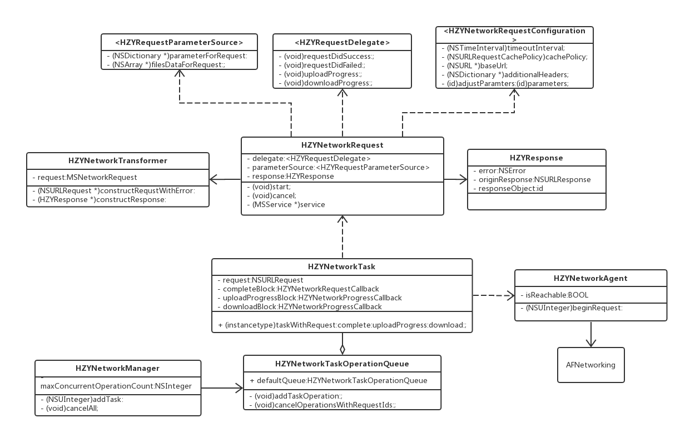

# HZYNetwork

## 结构简述
### 类之间的关系


### 工作流程
1. 通过子类化　HZYRequest 设置请求的基本参数（url，parameter等）；
2. 执行`- (void)start;`方法；
    1. 使用 configurator 和基本参数构造一个`HZYNetworkTask`对象，该对象将`NSURLRequest`和完成回调以及进度回调封装起来；
    2. 将`HZYNetworkTask`对象交给`HZYNetworkManager`单例
        1. 用`HZYNetworkTask`对象构造一个`HZYNetworkTaskOperation`
        2. 将`HZYNetworkTaskOperation`对象添加到`HZYNetworkTaskOperationQueue`队列中
3. 通过 delegate 方法或 block　获得响应。

## 快速上手
实现一个 HZYDemoURLRequest 类如下：

```
@interface HZYDemoURLRequest : HZYRequest
@end

@implementation HZYDemoURLRequest
- (NSString *)url {
    return @"http://www.mocky.io/v2/5ad857e83000003600e5872e";
}
@end
```

在要发起请求的地方执行如下方法

```
[[HZYDemoURLRequest requstUsingGETMethod] startWithSuccess:^(HZYRequest * _Nonnull request) {
        // success
} failure:^(HZYRequest * _Nonnull request) {
        // fail
}];
```

## 设计思路
在设计　HZYNetwork 的时候，我主要参考了Casa Taloyum（下文简称CT）大神的
[iOS应用架构谈 网络层设计方案](https://casatwy.com/iosying-yong-jia-gou-tan-wang-luo-ceng-she-ji-fang-an.html)，以及猿题库（下文简称YTK）的[YTKNetwork](https://github.com/yuantiku/YTKNetwork)，并结合自己对网络层的理解进行了实现。
在阐述 HZYNetwork 的设计思路之前，先来看看下面三个问题：AFNetworking 做了什么、AFNetworking 缺少什么、HZYNetwork 要提供了什么。

##### 1.AFNetworking 做了什么？
AFN对NSURLSession进行了封装，集中管理delegate，提供便利的NSURLSessionTask构造方法；对外将HTTP请求再次简化，使用时只需要考虑url、参数以及选择对应的HTTP方法。

##### 2.AFNetworking 缺少什么
- 发起请求是调用管理对象的方法，使得网络请求与控制器/视图高度耦合
- 每一个请求变成了一次方法调用，对于每个请求的具体区别处理变得困难；
- 难以对已经发出的请求进行批量操作；
- 没有模块化的入参出参校验；
- 没有办法管理多个请求之间的关系；
- 存在多条业务线时，无法提供业务线级别的针对性管理；

##### 3.HZYNetwork 要提供了什么
- 将请求独立封装，与请求相关的参数、设置等均集中在请求类中，减少控制器代码，增强代码可读性；
- 对象化请求，满足各种对请求的自定义需求；
- 提供 delegate 和 block 两种响应回调方式，增加编码的自由度，减少类间数据传递。
- 对请求提供批量管理：取消、暂停、恢复；并发发出、穿行发出、请求依赖等；
- 对入参出参的验证，将数据验证作为模块与业务解耦并且可复用；
- 区分业务线，分别管理。如缓存策略、超时时间、额外的通用入参、HTTP Header等；

### 对象化的请求，面向协议的接口
这也是 CT 和 YTK 不约而同所做的事情。对比二者的实现，在设计 HZYRequest 的时候我最终选择了 CT 的方案。原因很简单，看看二者的代码行数吧：
*CTAPIBaseManager.h -> 49行
YTKBaseRequest.h -> 335行*
说明一下，虽然命名不同，但二者在各自的框架中起到作用是相似的。那么为什么有这么大的差距呢？因为 CT 使用了面向协议的编程思想，CTAPIBaseManager 的接口只提供最基本的请求操作方法，如`- (NSInteger)loadData;`、`- (void)cancelAllRequests;`。而其他与请求弱相关或非必须实现的方法都丢给了不同的代理对象，如`paraHZYource`，`validator`等。这样做的好处就是极大的简化了接口，同时也不需要在基类的实现中写一大堆空方法。YTK 使用了最传统的面向对象思想，作为基类的YTKBaseRequest 必须实现所有原本是要给子类覆写的方法。所以你会看到它的实现文件中大量下面这样的方法，非常的不优雅：


基于此，HZYNetwork 也选择了面向协议的思想，HZYRequest 基类只提供最基本与请求强相关的属性和方法。如多重请求策略`strategy`，服务`service`，url`url`，以及`start`和`cancel`系列方法。将如回调代理、参数数据源、参数验证、数据重组等方法归集到各自的代理协议中，以代理的形式暴露。这样既简化了 HZYRequest 基类的接口、避免了大量无意义的空方法。同时这种设计思路也为今后的扩展提供了便利。

### 多个相同请求的处理
在业务中常见一种情况——列表的条件筛选。每一次用户改变筛选条件，都要通过一个稍微改变参数的请求来获取数据。当用户频繁的改变条件的时候，可能会出现下面的情况：
**请求已经发出，但尚未返回，此时用户修改了条件**
另一个常见的情况是，列表的下拉刷新：
**请求已经发出，但尚未返回，此时用户又进行了下拉刷新操作**
上面两种相似的情况，对请求的处理却不应该一样。针对前者，实际上我们应该丢弃旧的请求，只等待最新发出的请求。而对于后者，却应该是放弃发出新的请求，等待第一个请求的响应。
`HZYNetworkReqeust`有一个属性`@property (nonatomic, assign) HZYRequestStrategy strategy;`就是用来处理这种情况的，他提供了三个枚举：

```
typedef NS_ENUM(NSUInteger, HZYRequestStrategy) {
    /// 允许相同的请求多次发起
    HZYRequestStrategyAllowMultiple = 0,
    /// 在发起请求前检查如果有相同的请求尚未完成，则取消之前的请求
    HZYRequestStrategyCancelPreviousWhenStart,
    /// 在发起请求前检查如果有相同的请求尚未完成，则取消当前的请求
    HZYRequestStrategyDiscardIfPreviousOnLoading,
};
```
这样使得重复请求的处理变得非常简单。并且实现也非常简单，只要在请求真正发出前执行如下方法即可

```
/**
 执行请求策略
 
 @return 是否终止当前请求，YES终止，NO执行
 */
- (BOOL)perforHZYtrategy {
    switch (self.strategy) {
        case HZYRequestStrategyDiscardIfPreviousOnLoading:
            if (self.isLoading) {return YES;}
            break;
            
        case HZYRequestStrategyCancelPreviousWhenStart:
            [self cancelAll];
            break;
            
        case HZYRequestStrategyAllowMultiple:
            break;
    }
    return NO;
}

```
### 限制请求的最大并发数
作为网络优化的一部分，我们希望控制请求的并发量。比如当并发量限制为5的时候，同时发起了5个请求，如果这个五个请求没有任何一个完成响应，那么再发起的请求应该处于等待状态，直到前五个请求中有至少1个响应完成。
`HZYNetwork`维护了一个OperationQueue来达到这个目的。继承`NSOperation`实现了`HZYNetworkTaskOperation`来将请求任务和operation一一对应。在`-main`方法中执行task的`-resume`方法来发起请求。但这里遇到一个问题，`NSOperationQueue`中的operation在main方法执行完成就退出队列了，而不是等到请求响应之后，所以其实请求发起之后队列的位置就空出来了，这样就无法达到我们限制请求并发数的目的。这里的处理方式是用信号量。
在初始化`HZYNetworkTaskOperation`时创建一个信号量为0的信号量，在执行`resume`之后就执行`dispatch_semaphore_wait`方法等待，在请求响应之后执行`dispatch_semaphore_signal`增加信号量，使`-main`方法不再被阻塞，operation执行完毕。
这样就达到了限制最大并发的目的。

