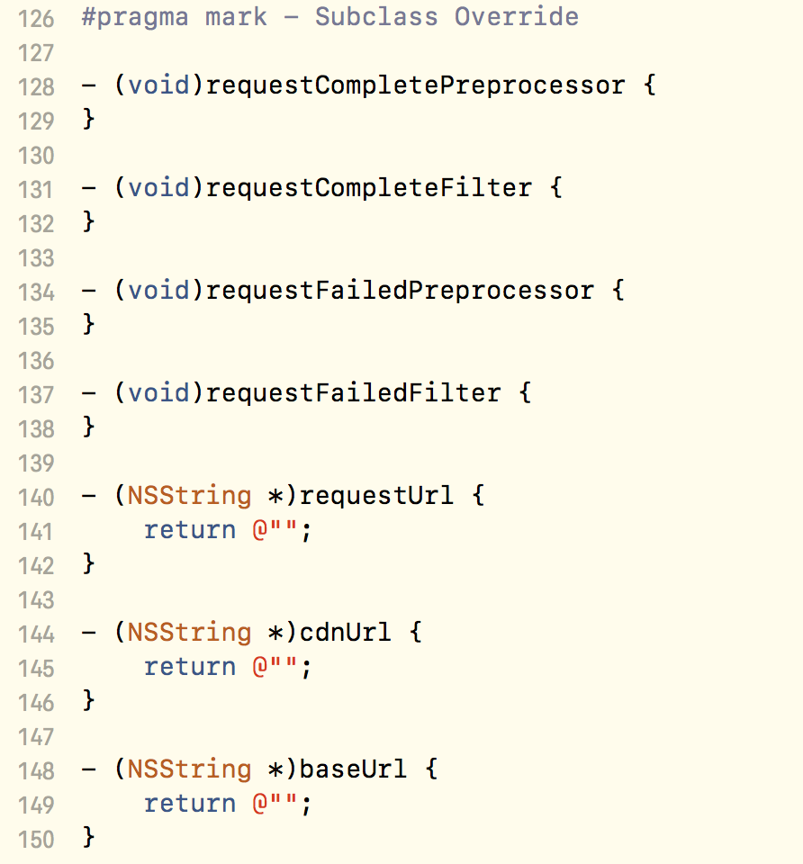

# HZYNetwork
## 使用Cocoapods

```
pod 'HZYNetwork'
```

# HZYNetwork

## 快速开始
简单的使用HZYNetwork发起网络请求只需要一个继承自HZYNetworkRequest的具体请求类。具体方式如下：

1、 创建一个DemoRequest类继承自HZYNetworkRequest，并重写- (NSString *)url方法；

```
@interface DemoRequest : HZYRequest
@end

@implementation DemoRequest
- (NSString *)url {
    return @"http://www.mocky.io/v2/5ad857e83000003600e5872e";
}
@end
```

2、 实例化DemoRequest并调用start方法；

```
[[DemoRequest requstUsingGETMethod] startWithSuccess:^(HZYRequest * _Nonnull request) {
        // success
} failure:^(HZYRequest * _Nonnull request) {
        // fail
}];
```

## 进阶使用指南
### 多种回调方式

HZYNetwork提供了delegate和block两种回调方式，可以根据习惯和场景选择使用，在快速开始的例子中使用的是block的回调方式，同时也提供了单一block回调的方法：

```
[[DemoRequest requstUsingPOSTMethod] startWithCompletion:^(HZYNetworkResponse * _Nonnull response) {
    if (response.error) {
        // error
    } else {
        // success
    }
}];
```

或者使用delegate的回调方式：

```
[[HZYIMUploadRequest requstUsingPOSTMethod] startWithDelegate:self];
```
除了成功和失败的回调，delegate还提供了上传和下载进度的回调方法：

```
- (void)request:(HZYNetworkRequest *)request uploadProgress:(NSProgress *)progress;
- (void)request:(HZYNetworkRequest *)request downloadProgress:(NSProgress *)progress;
```

### 不同的HTTP方法

HZYNetwork支持常见的GET、POST、HEAD、PUT、DELETE方法。一个请求使用什么方法取决于初始化的参数。HZYNetworkRequest的指定初始化方法是

```
- (instancetype)initWithMethod:(HZYNetworkRequestMethod)method;
```

该方法支持任何`HZYNetworkRequestMethod`类型的参数。HZYNetwork框架内置了下面几种参数：

```
FOUNDATION_EXPORT HZYNetworkRequestMethod const GET;
FOUNDATION_EXPORT HZYNetworkRequestMethod const POST;
FOUNDATION_EXPORT HZYNetworkRequestMethod const HEAD;
FOUNDATION_EXPORT HZYNetworkRequestMethod const PUT;
FOUNDATION_EXPORT HZYNetworkRequestMethod const DELETE;
```

如果需要使用其他的HTTP方法可以添加`HZYNetworkRequestMethod`类型的参数，在初始化时赋值即可。例如需要添加CONNECT方法则定义如下参数并在初始化时传入即可：

```
static HZYNetworkRequestMethod const CONNECT = @"CONNECT";
```

除此以外，考虑到日常开发最常用的是GET和POST方法，HZYNetworkRequest提供了便捷初始化方法：

```
/** GET请求 */
+ (instancetype)requstUsingGETMethod;
/** POST请求 */
+ (instancetype)requstUsingPOSTMethod;
```

### 使用configurator
对于一个中小型项目或一个大型项目的某个模块，其所有的请求可能都有相同的baseUrl、超时时间、缓存策略、请求头、通用请求参数。`HZYNetworkRequest`的`configurator`属性就是用来统一配置这些内容的。下面是一个例子

```
@interface ExampleRequestConfigurator : NSObject <HZYNetworkRequestConfiguration>

@end

@implementation ExampleRequestConfigurator

- (NSURL *)baseUrl {
    return [NSURL URLWithString:@"http://abc.def.gh"];
}

- (NSTimeInterval)timeoutInterval {
    return 15;
}

- (NSURLRequestCachePolicy)cachePolicy {
    return NSURLRequestReloadIgnoringLocalCacheData;
}

- (NSDictionary<NSString *,NSString *> *)additionalHeadersForRequest:(HZYNetworkRequest *)request {
    return @{@"customHeader" : @"abced"};
}

- (id)adjustParamters:(id)parameters {
    NSMutableDictionary *param = [parameters mutableCopy];
    [param addEntriesFromDictionary:@{@"deviceId" : @"11111",
                                      @"userId" : @"22222",
                                      @"other" : @"3333"
                                      }];
    return param;
}

@end

```


### 取消请求
以 "start" 开头的发起请求方法都有一个NSUInteger类型返回值，该值是此请求的全局唯一id，通过这个id可以实现取消请求的操作。调用

```
- (void)cancelWithId:(NSUInteger)requestId;
```
来取消指定的请求。
关于请求取消时的状态说明：由于HZYNetwork维护一个并发队列来控制请求并发量，所以对一个request执行start方法之后该请求会有两种可能的状态：
1、请求队列未达到最大并发数，直接开始执行；
2、请求队列达到最大并发数，该请求的执行被阻塞等待；
于是对于取消来说，也就存在两种情况：
1、请求仍在队列中等待，尚未开始；
2、请求已经发出，但尚未收到响应；
对于这两种情况，执行`- (void)cancelWithId:(NSUInteger)requestId;`都可以达到预期的效果——响应回调不会执行。只不过对于第一种情况，请求不会真正发出，而第二种情况，会执行`NSURLSessionTask`的`cancel`方法。

#### 关于- (void)cancelAll方法
需要注意的一点是，这个方法所cancel的不是所有的请求，而是当前请求对象发起的所有请求。举个例子，有一个叫做`GetUserInfoRequest`的请求，通过传入不同的userId来获取不同的用户信息，现在为了获取10个用户信息，实例化了一个`GetUserInfoRequest`对象，通过传入一个userId，调用一次start方法的方式发起了十次请求。那么如果想要取消这十个请求就可以调用`- (void)cancelAll`方法。

### 实现响应结果自动转换为模型对象
`HZYNetworkRequest`有一个`responseReformer`属性，接收遵循`<HZYNetworkResponseReformer>`的对象。可以通过该协议来实现响应结果自动转模型。首先创建一个对象遵循该协议，并添加一个类型为`Class`的属性用来存储json对象应该转换为的模型的类型。然后就可以在`- (id)request:(HZYNetworkRequest *)request reformResponseObject:(id)responseObject error:(NSError **)error;`方法中将json对象转换为模型对象并返回。示例代码如下：

```
@interface ExampleResponseReformer : NSObject <HZYNetworkResponseReformer>
@property (nonatomic, strong) Class *modelClass;
@end

@implementation ExampleResponseReformer
- (id)request:(HZYNetworkRequest *)request reformResponseObject:(id)responseObject error:(NSError * _Nullable __autoreleasing *)error {
    if (error) {return responseObject;}
    return [self.class modelWithJsonObject:responseObject];
}
@end

```
### 监听网络连接状态
可以通过`HZYNetworkManager`的

```
/**
 开始监听网络状态
 */
- (void)startMonitoringConnectivity;

/**
 结束监听网络状态
 */
- (void)stopMonitoringConnectivity;
```
来开始和结束监听网络连接状态。

通过

```
/** 网络连接状态改变的通知 */
FOUNDATION_EXPORT NSNotificationName const HZYNetworkReachabilityDidChangedNotification;
/** HZYNetworkReachabilityDidChangedNotification通知的userInfo中该key存储对应HZYNetworkReachabilityStatus的值 */
FOUNDATION_EXPORT NSString * const HZYNetworkReachabilityNotificationStatusKey;
```
来监听网络状态变化的通知，并获取当前的网络状态

### 批量请求
如果需要发送多个请求并在所有请求都成功回调之后才执行完成回调，可以使用`HZYNetworkBatchRequest`。

```
/**
 批量发出请求，统一回调。

 @param requests 要发送的请求
 @param success 成功的回调，只有每个请求都成功才会执行这个回调
 @param fail 只要有一个以上的请求失败，就会走这个回调
 */
+ (void)sendReqeusts:(NSArray<HZYNetworkRequest *> *)requests
             success:(HZYNetworkRequestsSuccessBlock)success
             failure:(HZYNetworkRequestsFailurBlock)fail;

```
传入已经实例化的`HZYNetworkRequest`对象，只有所有传入的请求都成功响应，`success`才会执行，否则执行`failure`；


## 结构简述
### 类之间的关系


## 设计思路
在设计　HZYNetwork 的时候，我主要参考了Casa Taloyum（下文简称CT）大神的
[iOS应用架构谈 网络层设计方案](https://casatwy.com/iosying-yong-jia-gou-tan-wang-luo-ceng-she-ji-fang-an.html)，以及猿题库（下文简称YTK）的[YTKNetwork](https://github.com/yuantiku/YTKNetwork)，并结合自己对网络层的理解进行了实现。
在阐述 HZYNetwork 的设计思路之前，先来看看下面三个问题：AFNetworking 做了什么、AFNetworking 缺少什么、HZYNetwork 要提供了什么。

##### 1.AFNetworking 做了什么？
AFN对NSURLSession进行了封装，集中管理delegate，提供便利的NSURLSessionTask构造方法；对外将HTTP请求再次简化，使用时只需要考虑url、参数以及选择对应的HTTP方法。

##### 2.AFNetworking 缺少什么
- 发起请求是调用管理对象的方法，使得网络请求与控制器/视图高度耦合
- 每一个请求变成了一次方法调用，对于每个请求的具体区别处理变得困难；
- 难以对已经发出的请求进行批量操作；
- 没有模块化的入参出参校验；
- 没有办法管理多个请求之间的关系；
- 存在多条业务线时，无法提供业务线级别的针对性管理；

##### 3.HZYNetwork 要提供了什么
- 将请求独立封装，与请求相关的参数、设置等均集中在请求类中，减少控制器代码，增强代码可读性；
- 对象化请求，满足各种对请求的自定义需求；
- 提供 delegate 和 block 两种响应回调方式，增加编码的自由度，减少类间数据传递。
- 对请求提供批量管理：取消、暂停、恢复；并发发出、穿行发出、请求依赖等；
- 对入参出参的验证，将数据验证作为模块与业务解耦并且可复用；
- 区分业务线，分别管理。如缓存策略、超时时间、额外的通用入参、HTTP Header等；

### 对象化的请求，面向协议的接口
这也是 CT 和 YTK 不约而同所做的事情。对比二者的实现，在设计 HZYRequest 的时候我最终选择了 CT 的方案。原因很简单，看看二者的代码行数吧：
*CTAPIBaseManager.h -> 49行
YTKBaseRequest.h -> 335行*
说明一下，虽然命名不同，但二者在各自的框架中起到作用是相似的。那么为什么有这么大的差距呢？因为 CT 使用了面向协议的编程思想，CTAPIBaseManager 的接口只提供最基本的请求操作方法，如`- (NSInteger)loadData;`、`- (void)cancelAllRequests;`。而其他与请求弱相关或非必须实现的方法都丢给了不同的代理对象，如`paramSource`，`validator`等。这样做的好处就是极大的简化了接口，同时也不需要在基类的实现中写一大堆空方法。YTK 使用了最传统的面向对象思想，作为基类的YTKBaseRequest 必须实现所有原本是要给子类覆写的方法。所以你会看到它的实现文件中大量下面这样的方法，非常的不优雅：


基于此，HZYNetwork 也选择了面向协议的思想，HZYRequest 基类只提供最基本与请求强相关的属性和方法。如多重请求策略`strategy`，服务`service`，url`url`，以及`start`和`cancel`系列方法。将如回调代理、参数数据源、参数验证、数据重组等方法归集到各自的代理协议中，以代理的形式暴露。这样既简化了 HZYRequest 基类的接口、避免了大量无意义的空方法。同时这种设计思路也为今后的扩展提供了便利。

### 多个相同请求的处理
在业务中常见一种情况——列表的条件筛选。每一次用户改变筛选条件，都要通过一个稍微改变参数的请求来获取数据。当用户频繁的改变条件的时候，可能会出现下面的情况：
**请求已经发出，但尚未返回，此时用户修改了条件**
另一个常见的情况是，列表的下拉刷新：
**请求已经发出，但尚未返回，此时用户又进行了下拉刷新操作**
上面两种相似的情况，对请求的处理却不应该一样。针对前者，实际上我们应该丢弃旧的请求，只等待最新发出的请求。而对于后者，却应该是放弃发出新的请求，等待第一个请求的响应。
`HZYNetworkReqeust`有一个属性`@property (nonatomic, assign) HZYRequestStrategy strategy;`就是用来处理这种情况的，他提供了三个枚举：

```
typedef NS_ENUM(NSUInteger, HZYRequestStrategy) {
    /// 允许相同的请求多次发起
    HZYRequestStrategyAllowMultiple = 0,
    /// 在发起请求前检查如果有相同的请求尚未完成，则取消之前的请求
    HZYRequestStrategyCancelPreviousWhenStart,
    /// 在发起请求前检查如果有相同的请求尚未完成，则取消当前的请求
    HZYRequestStrategyDiscardIfPreviousOnLoading,
};
```
这样使得重复请求的处理变得非常简单。并且实现也非常简单，只要在请求真正发出前执行如下方法即可

```
/**
 执行请求策略
 
 @return 是否终止当前请求，YES终止，NO执行
 */
- (BOOL)performStrategy {
    switch (self.strategy) {
        case HZYRequestStrategyDiscardIfPreviousOnLoading:
            if (self.isLoading) {return YES;}
            break;
            
        case HZYRequestStrategyCancelPreviousWhenStart:
            [self cancelAll];
            break;
            
        case HZYRequestStrategyAllowMultiple:
            break;
    }
    return NO;
}

```
### 限制请求的最大并发数
作为网络优化的一部分，我们希望控制请求的并发量。比如当并发量限制为5的时候，同时发起了5个请求，如果这个五个请求没有任何一个完成响应，那么再发起的请求应该处于等待状态，直到前五个请求中有至少1个响应完成。
`HZYNetwork`维护了一个OperationQueue来达到这个目的。继承`NSOperation`实现了`HZYNetworkTaskOperation`来将请求任务和operation一一对应。在`-main`方法中执行task的`-resume`方法来发起请求。但这里遇到一个问题，`NSOperationQueue`中的operation在main方法执行完成就退出队列了，而不是等到请求响应之后，所以其实请求发起之后队列的位置就空出来了，这样就无法达到我们限制请求并发数的目的。这里的处理方式是用信号量。
在初始化`HZYNetworkTaskOperation`时创建一个信号量为0的信号量，在执行`resume`之后就执行`dispatch_semaphore_wait`方法等待，在请求响应之后执行`dispatch_semaphore_signal`增加信号量，使`-main`方法不再被阻塞，operation执行完毕。
这样就达到了限制最大并发的目的。


